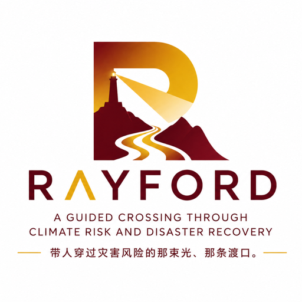

# Rayford AI

  

  <strong>A guided crossing through climate risk and disaster recovery.</strong>

Rayford AI builds **Ray**, a property-level resilience intelligence platform for
disaster damage assessment, recovery decisions, and future climate-risk
readiness.

Our first product focus is **Ray Assess**: turning post-disaster imagery,
property context, and model evidence into review-ready damage assessment for
local governments, emergency managers, GIS teams, and recovery partners.

## What We Are Building

**Ray Assess** helps teams understand what changed after a disaster, which
properties need attention first, and what evidence supports that judgment.

**Ray Claims** extends the same evidence package into claims and inspection
triage after the public-sector assessment workflow is validated.

**Ray Risk** connects damage evidence with local hazard history, mitigation
priorities, and grant or recovery documentation.

Long term, Rayford AI aims to become the property-level evidence layer for
resilience: one place to connect hazard history, post-event imagery, model
confidence, and human review.

## Why It Matters

Disaster recovery is still slowed by fragmented imagery, manual inspection
queues, inconsistent documentation, and uncertainty over what happened to each
property.

Rayford AI starts from a narrow, practical question:

> Given a property after a disaster, can Ray produce a damage score, confidence,
> and evidence trail fast enough for a human team to act?

That is the first wedge. The broader mission is to help every exposed property
become more ready, assessable, and recoverable.

## Research Origin

Rayford AI grows out of GeoAI and disaster-resilience research at Texas A&M,
including work on street-view disaster assessment, multimodal damage perception,
satellite-to-street generation, and model arbitration for hurricane damage
assessment.

Public research context is available at
[AutoGeoAI4Sci](https://autogeoai4sci.github.io/).

## Repository Policy

This organization separates public company material from private venture work.

- Public repositories may include company profiles, website-facing assets,
  public documentation, and selected research links.
- Private repositories hold product code, internal strategy, customer discovery,
  model workflows, data pipelines, and other proprietary work.

Rayford AI is not an open-source project by default. Public materials are shared
for visibility, evaluation, and collaboration conversations; proprietary code,
data, designs, and venture materials remain protected unless explicitly
released.

## Links

- Website: [rayford-ai.com](https://rayford-ai.com)
- LinkedIn: [Rayford AI](https://www.linkedin.com/company/rayford-ai)
- Contact: [contact@rayford-ai.com](mailto:contact@rayford-ai.com)

---

**Every property, ready and recoverable.**
